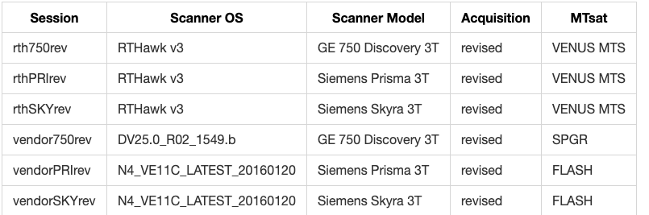

# VENUS
Analysis repository for VEndor NeUtral Sequence (VENUS) dataset

[](https://mybinder.org/v2/gh/qMRLab/venus/HEAD) [](https://osf.io/5n3cu/) 


Above data is acquired for `sub-phantom` (ISMRM/NIST system phantom) and for 3 healthy subjects, yielding 24 for acquisitions.

# To execute workflows 

1. Install [Nextflow](https://www.nextflow.io/docs/latest/getstarted.html)
2. Pull Docker images:
    ```
    docker pull qmrlab/minimal:v2.5.0b
    docker pull qmrlab/antsfsl:latest
    ```
3. Download the [dataset](https://osf.io/5n3cu/)
4. Run

Process phantom data
```
nextflow run venus-process-phantom.nf --bids /set/to/bids/directory -with-report phantom-report.html
```
Process in-vivo data
```
nextflow run venus-process-invivo.nf --bids /set/to/bids/directory -with-report invivo-report.html
```

## If Docker is not available 

You need to make sure that following dependencies are installed on your local machine/environment and accessible via shell (i.e. added to the system PATH):

* ANTs 
* FSL 
* MATLAB or Octave 

In the config file, set the following parameter to `false`, this will enforce workflow to look for local executables.
https://github.com/qMRLab/VENUS/blob/90df3f94aa0c07ee2a116b9ad5785b2b0057fa60/nextflow.config#L131-L133

Next, set MATLAB or Octave executable path and qMRLab directory
https://github.com/qMRLab/VENUS/blob/90df3f94aa0c07ee2a116b9ad5785b2b0057fa60/nextflow.config#L144-L148

Execute the workflows using the commands above. 
